### Лабораторная работа №2

Выполнил: Назаров Александр Олегович ББСО-01-18:
##### Задание 1
По заданию я выбрал соответствующие характеристики для виртуалки:

Потом приступил к ручной разметке:

Создал разметкупод raid:

Создал RAID1:

Создал группу томов LVM:

Установил томам LVM точки монтирования:

Далее установил GRUB на sda:

Всё работает:

С помощью lsblk посмотрел информацию о состоянии дисков. С помощью команды dd if=/dev/sda1 of=/dev/sdb1 я копировал содержимое раздела /boot с диска sda (ssd1) на диск sdb (ssd2). Выполнил установку загрузчика ОС на второй диск с помощью grub-install /dev/sdb. Теперь в случае отказа первого диска система сможет спокойно загрузится:

C помощью cat /proc/mdstat я увидел состояние raid, где md0 — имя RAID устройства; raid1 sda2[0] sdb2[1] — из каких дисков собран; 1046528 blocks — размер массива; [2/2] [UU] — количество юнитов, которые на данный момент используются:
pvs - выводит информацию о физической памяти:
lvs - выводит информацию о Logical Volume:
vgs - выводит информацию о группе томов LVM:

##### Задание 2
Команда fdisk -l после удаления диска ssd1 показала следующее:

Cоздал новый диск. Cистема его видит. Скопировал таблицу разделов со старого диска на новый с помощью sfdisk -d /dev/sda | sfdisk /dev/sdb и добавил новый диск в наш raid c помощью команды mdadm --manage /dev/md0 --add /dev/sdb2. Получил:

После установил GRUB и копировал раздел в /boot 

##### Задание №3

Проэмулировал отказ диска ssd2, удалив его из свойств ВМ:

Добавил один новый ssd диск, назвав его ssd4:

Копирую файловую таблицу со старого диска на новый: sfdisk -d /dev/sda | sfdisk /dev/sdb:

Выполним команду lsblk -o NAME,SIZE,FSTYPE,TYPE,MOUNTPOINT и затем с помощью команды dd скопируем данные /boot на новый диск :

Устанавливаю загрузчик на новый диск sdb: grub-install /dev/sdb . Далее создаем новый рейд-массив(mdadm --create --verbose /dev/md63 --level=1 --raid-devices=1 /dev/sdb2. В итоге у нас установлен новый RAID-массив md63, проверяем при помощи команды cat /proc/mdstat:

Настраиваем LVM:
Создаём новый физический том, включив в него ранее созданный RAID-массив: pvcreate /dev/md63 и проверяем командой lsblk -o NAME,SIZE,FSTYPE,TYPE,MOUNTPOINT:

LV var,log,root находятся на диске sda:

Выполняю перемещение данных со старого диска на новый, не получается. Пришлось заново поставить систему и провести все операции

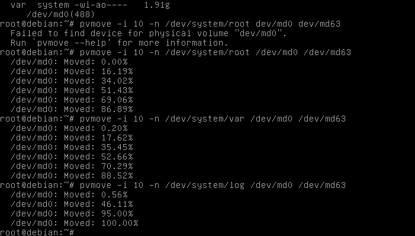

Видно, что данные находятся на одном диске:  
  
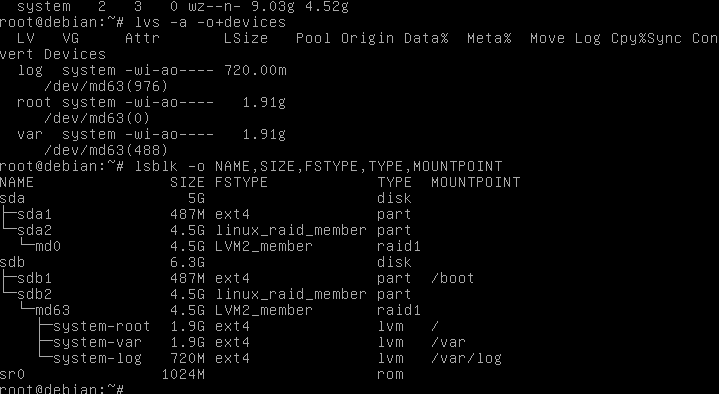  
  
Изменил Volume Group, удалив из него диск старого raid и также проверякм, что раздел /boot не пустой :  
  
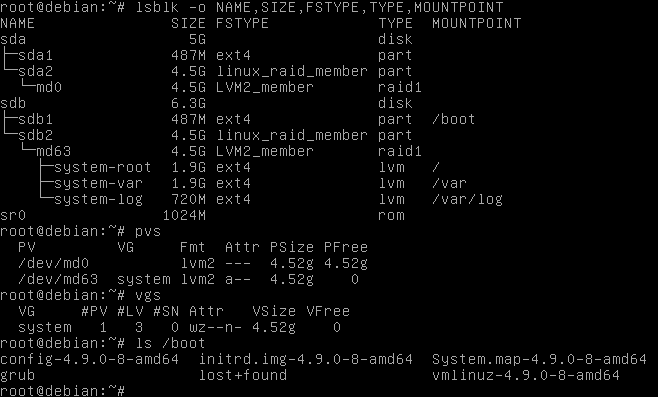  
  
Проверим, что произошло после добавления дисков (диски появились):  
  
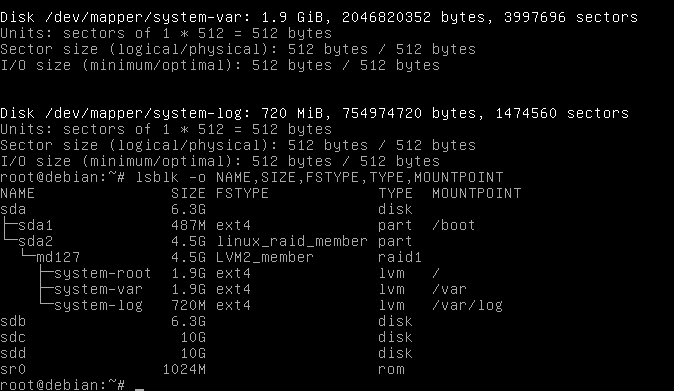  
  
Когда мы скопировали таблицу разделов со старого диска оказалось, что новый размер не использует весь объем жесткого диска:  
  
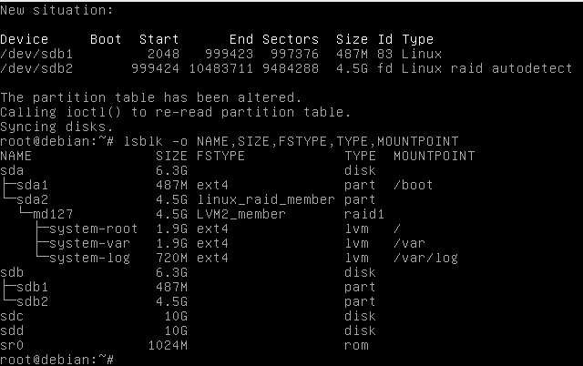  
  
Cкопируем загрузочный раздел /boot с диска ssd4 на ssd5 `dd if=/dev/sda1 of=/dev/sdb1` и установим grub на новый диск (ssd5):  
  
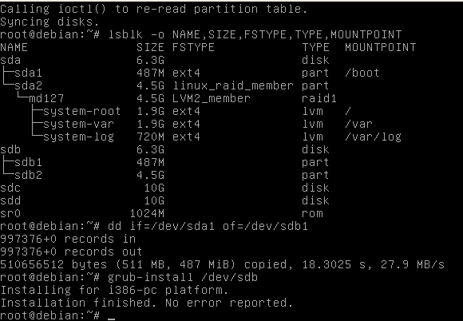  
  
Сначала изменили размер второго раздела диска ssd5 (sdb), затем перечитали таблицу разделов и провели результат:  
  
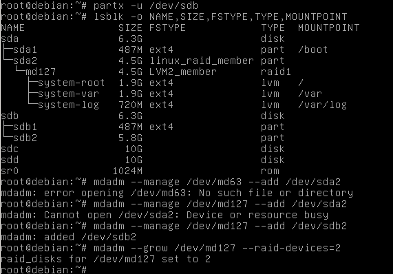   
  
Добавляем новый диск к текущему RAID-массиву, расширяем количество дисков в нашем массиве до 2-х штук.  
  
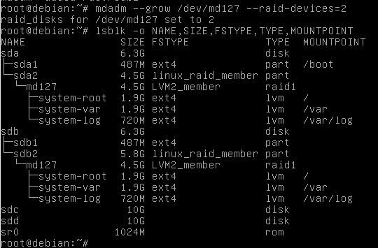  
  
Сначала увеличили размер раздела на диске ssd4 (sda), а затем перечитали таблицу разделов и проверили результат:  
  
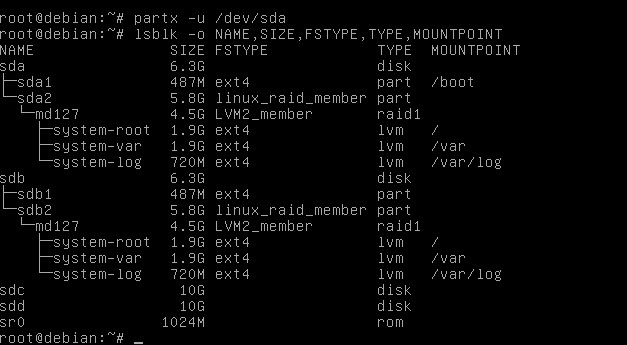   
  
Получили sda2 и sdb2 разделы, которые имеют размер > чем размер RAID-устройство.  
  
Расширяем размер RAID   
  
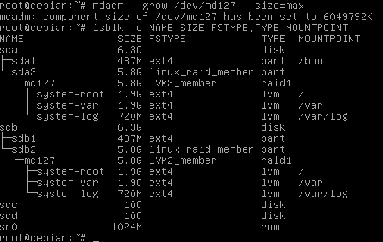   
  
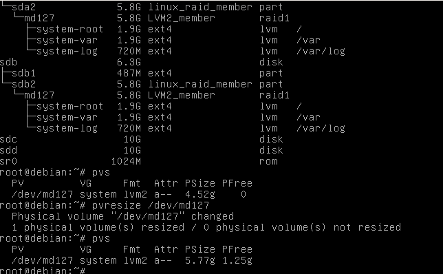  

Увеличили объём памяти ssd4, ssd5.  
  
Завершили миграцию основного массива на новые диски, работа с ssd4 и ssd5 закончена.  
  
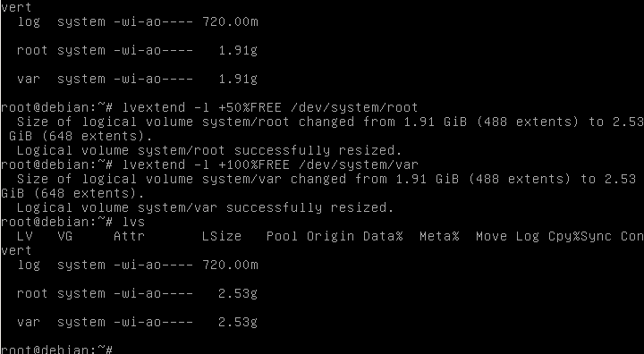   

Перемещаем `/var/log` на новые диски, для этого создаем новый RAID-массив, создаём логический том:  
  
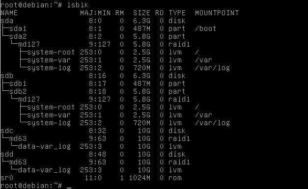 

Перетащил данные логов со старого раздела на новый:  
  
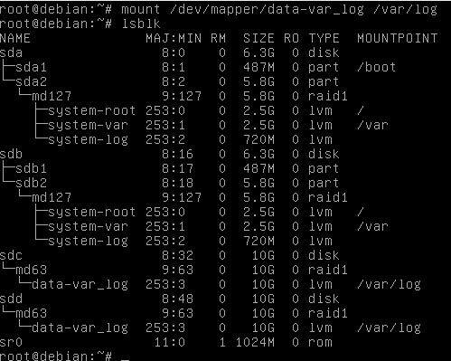   
  
Редактирую /etc/fstab fstab - файл, в котором записываются правила, по которым при загрузке будут смонтированы разделы (поправляю устройство 'system-log' на 'data-var_log') и затем используем команду resize2fs для изменения ФС:
  
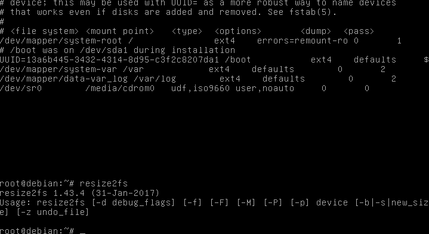  
  
Выполним перезагрузку, а затем проверку, что сделано всё, что хотели:   
Завершили установку:   
  
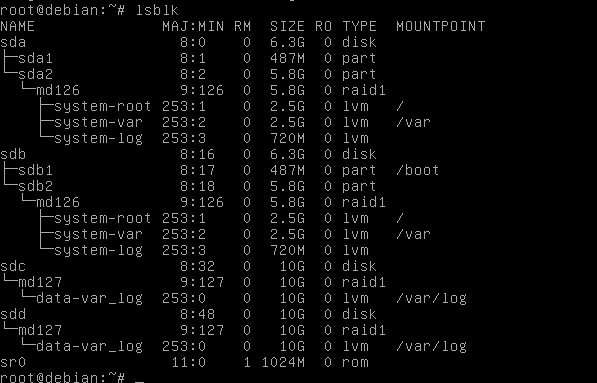   
  
Завершили установку.  

В итоге за эту лабораторную я создал виртуалку с двумя дисками, настроил работу ЛВМ, провел имитацию аварии диска, заменил диск на лету и перенёс разделы.
